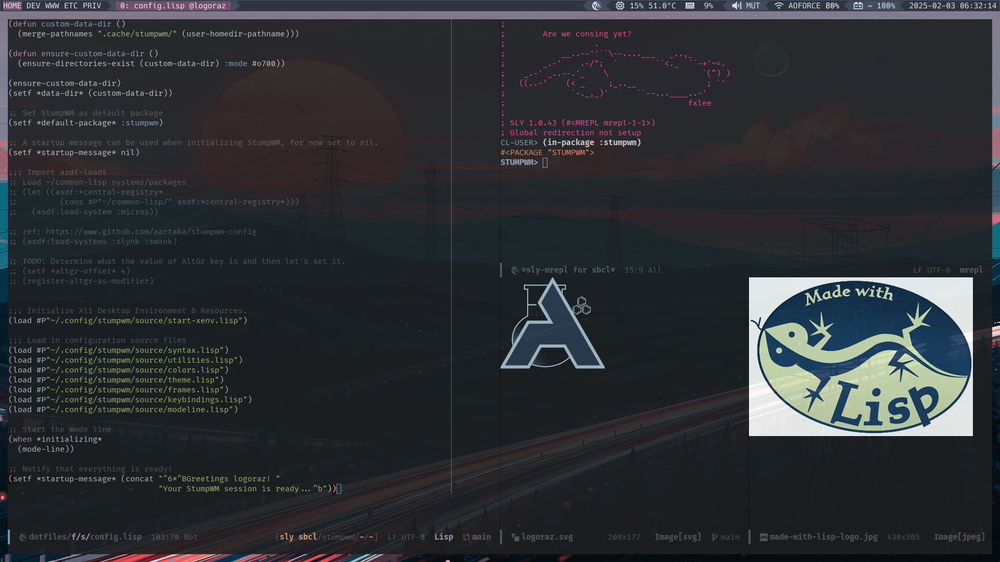
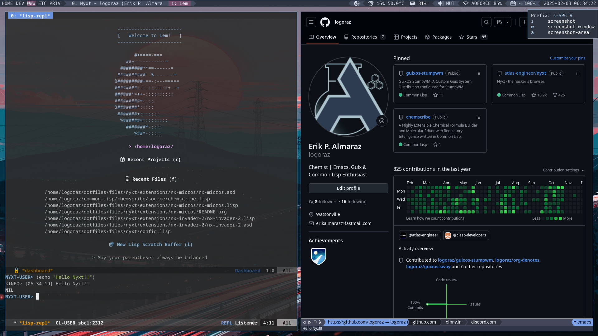

# GuixOS (System + Home) StumpWM Configuration

GuixOS StumpWM ("Crystallized Momentum"): A Custom Guix System Distribution configured for StumpWM.
Riding out the wave of X11, until [StumpWM/Mahogany](https://github.com/stumpwm/mahogany)
is ready for use!

This is specifically setup and trailed with my Lenovo ThinkPad X1 Carbon 4th Gen (Type 20FB)
Laptop.


## Screenshots






## Project Scaffolding

```scm
    dotfiles/                                ;; Project Root
    |- config/
       |- home/                              ;; GuixOS Home Config Root
          |- home-config.scm                 ;; ** GuixOS StumpWM Home Config **
          |- dot-bash_profile.sh
          |- dot-bashrc.sh
          |- services/                       ;; Home Service Modules
             |- environment.scm
             |- home-impure-symlinks.scm
             |- mutable-files.scm
             |- streaming.scm
             |- udiskie.scm
             |- xdg-files.scm
       |- packages/                          ;; Custom GuixOS Package Modules
          |- video.scm
          |- devtools-manifest.scm
          |- org-docs-manifest.scm
       |- services/                          ;; Custom GuixOS Service Modules
          |- tbd
       |- system/                            ;; GuixOS Config Root
          |- system-config.scm               ;; ** GuixOS StumpWM System Config **
          |- channels.scm
    |- files/                                ;; XDG_CONFIG_HOME Files (=> xdg-files.scm)
       |- assets/...
       |- common-lisp/...
       |- gnupg/...
       |- guile/...
       |- isync/...
       |- msmtp/...
       |- emacs/...
       |- lem/...
       |- nyxt/...                           ;; New!! Nyxt Config
       |- stumpwm/                           ;; StumpWM Config
          |- config
          |- source/
          |- modules/
       |- xorg/...
       |- zathura/...                        ;; tbd
```


## Philosophy

 - Create a highly functional WM setup that is efficient & aesthetic.
 - Configure everything using Common Lisp, Guile/Guix where possible!
 - Construct a modulur Guix System configuration as a Guile program.
 - Handle customizations as custom Guix packages & services.
 - Generalize to support setup on multiple machines.
 - Optimize to create an efficient system for hacking in Common Lisp.
 - Eventually create a System/Home service utility that enhances Guix.   
 - Use Common Lisp & Guile programs where possible.

## Download & Install

First download and install Guix System from either of the release images below:

 - https://github.com/SystemCrafters/guix-installer
 - https://gitlab.com/nonguix/nonguix/-/releases

Once Guix has been installed from the release image, and the defined `channels`
file has be unlocked from a specific commit, do a `guix pull` to get to the
latest.

I personally use the SystemCrafters Guix release image as it comes
preconfigured with items that ease the pain of installation and the
instructions are excellent, see:
https://systemcrafters.net/craft-your-system-with-guix/full-system-install/

Next, download this project repo and edit the GuixOS configuration module
with your machine and user specific information, i.e. `swap-devices`,
`file-systems`, `user-account`, and `%user-name`. Note: See
"Establishing WiFi" section on a refresher for connecting to wifi via nmcli.

You probably won't have git installed, hence the `guix shell` command.

```bash

    $ guix shell git # Install git via guix shell...
    $ git clone https://github.com/logoraz/guixos-stumpwm.git ~/dotfiles
    $ cd ~/dotfiles
    
    # Edit GuixOS configuration module
    $ emacs ./config/system/system-config.scm

```

Also, you will need to edit the following Home modules with your specific
information:

  - `/.config/home/services/xdg-files.scm` => `%user-name`
  - `/.config/home/services/environment.scm` => `%user-name`
  - [`./config/home/home-config.scm` => `home-bash-configuration`] 
    - Optional if you choose a different root project directory name...

Note: I am currently working to generalize this to define machine and user
specific variables in one place...

Now we are ready to install GuixOS StumpWM ("Crystallized Momentum"):

```bash

    $ sudo guix system -L ~/dotfiles/ \
      reconfigure ~/dotfiles/config/system/system-config.scm

    $ guix home -L ~/dotfiles/ \
      reconfigure ~/dotfiles/config/home/home-config.scm

```

Once the initial install is complete, you will be able to reconfigure using
the commands `gosr` & `gohr` if you choose to keep this project scaffolding, 
else you will need to edit `home-bash-configuration` in `home-config.scm`.


## Establishing Wifi

This can be done with the UI via `nm-connection-editor`, but I like to keep
reference to `nmcli`. Working on figuring out how to establish a 'clickable'
swaybar icon to automatically bring up `nm-connection-editor`. stay tuned...

```bash
  # List Wifi networks available
  $ sudo nmcli device wifi list

  # Connect to ESSID
  $ sudo nmcli device wifi connect <ESSID> password <network-password>
```

List known connections and delete them from list in Network Manager.

```bash
  # Get ESSID (name) or UUID of connection to delete
  $ sudo nmcli connection show

  # Delete connection via ID (aka name or ESSID)
  $ sudo nmcli connection delete <ESSID>
```


## Establishing Bluetooth

Bluetooth works and is automatically deployed via bluez in Guix system config,
however, initial device connection first needs to be established via
`blueman-manager`.

Still working on better integration, such as auto-starting `blueman-applet`
in sway config, however, it currently has a bug in it's dbus service that has
yet to be addressed, see https://issues.guix.gnu.org/71528. Note this handles
bluetooth connection interfacing with sway, i.e. detection and notifications.
You can start it up in a shell (and get a ugly warning message) once in
your sway session - I usually don't and things still work, but with out
notifications...

## TODOs (Wish List)

 - Create base system config to apply to machine-specific configurations [Issue #4] 
 - Implement/Use bcacefs for file systems [Issue #5]
 - Minimize dependency on `xdg-files` (reserved for one-off's where possible)
 - Research solution to blueman-applet: https://issues.guix.gnu.org/71528

   
## References:

  - [StumpWM Configuration Inspiration](https://config.phundrak.com/stumpwm)
  - [How to Organize Your Guix Config](https://systemcrafters.net/craft-your-system-with-guix/how-to-organize-your-config/)
  - [Configuring Rational Emacs with Guix Home](https://systemcrafters.net/live-streams/july-8-2022/)
  - [Xorg Response Lag Solution](https://gitlab.com/nonguix/nonguix/-/issues/212)
  - TBD
  - TBD
